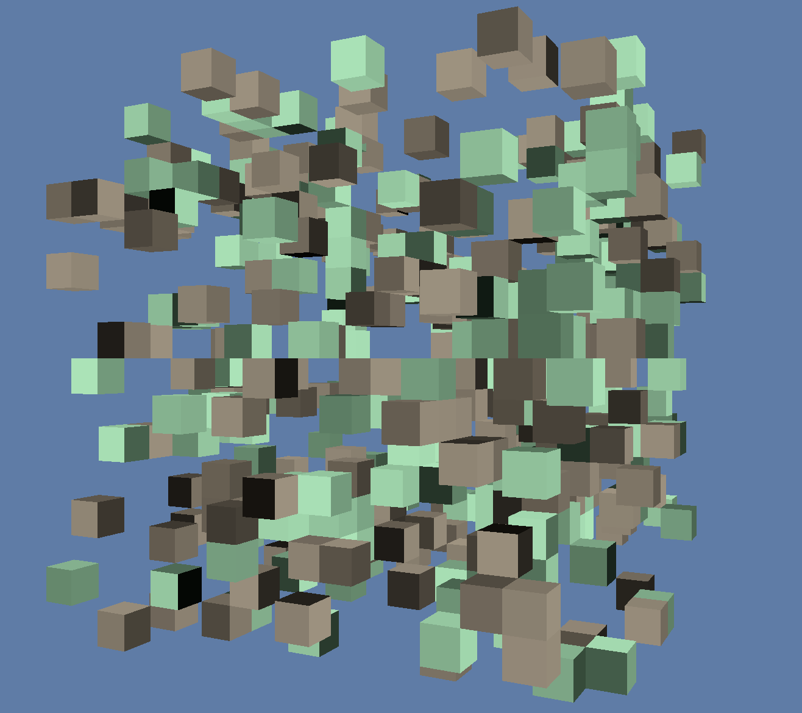

# voxel-planet

A tech demo

## ✅ Progress

- [X] Read the [Rust book](https://doc.rust-lang.org/stable/book/) (May 2021)
- [X] Follow a [wgpu tutorial](https://sotrh.github.io/learn-wgpu/) (May 2021)
- [X] Get a grasp on [winit](https://crates.io/crates/winit) (May 2021)
- [X] Write the boilerplate from memory (June 3, 2021)
- [X] Colored voxels (June 5, 2021)
- [X] Camera + movement (June 6, 2021)
- [ ] Chunks
- [ ] Terrain editing
- [ ] Collision detection
- [ ] Gravity
- [ ] Noisy terrain generation
- [ ] Make video
- [ ] Add more screeshots here
- [ ] Make video & repository available to Patrons
- [ ] Add video link here
- [ ] Post video
- [ ] Make repository public after two weeks

### ✨ Extra credit

- [ ] Text rendering for debug info
- [ ] Secondary free camera to assist in debugging
- [ ] Sliders to vary values in ranges w/o recompiling
- [ ] Benchmark performance for the following chunk-rendering strategies:
  - CPU-side face culling w/ one mesh for each face (the original)
  - Whole chunk w/ one mesh

## 🔥 Getting started

- [Install Rust 🦀](https://www.rust-lang.org)
- Clone this repo & do a `cargo run`
- Make some tea while it compiles ~

## 🌈 Learning resources

- [Learn wgpu](https://sotrh.github.io/learn-wgpu/)
- [Building WebGPU with Rust @ FOSDEM 2020](https://www.youtube.com/watch?v=vV8mwo65kR8)
- [The Rust Programming Language](https://doc.rust-lang.org/stable/book/)
- [Rust Cheat Sheet](https://cheats.rs/)
- [WGSL specification](https://gpuweb.github.io/gpuweb/wgsl/)
- [Camera: Forward vector from yaw & pitch](https://gamedev.stackexchange.com/questions/190054/how-to-calculate-the-forward-up-right-vectors-using-the-rotation-angles)